 

## `$ cat MODEL_CARD.md`

> I spend my time evaluating models — so here's my own model card.

|                  |                                                                                                        |
| ---------------- | ------------------------------------------------------------------------------------------------------ |
| **Model**        | `parshawn-haynes` · junior build · stable release **May 2028**                                          |
| **Architecture** | Data Science × Applied Statistics double major, AI/ML fine-tune — **Purdue University**                 |
| **Currently**    | GenAI Engineer Intern @ **Protiviti** · **AI4ALL Ignite** Research Fellow · Data Mine Fellow            |
| **Specialty**    | **LLM evaluation** — benchmarks, hallucination detection, eval harnesses for agentic systems            |
| **Training data**| SEC 10-K filings · 395K+ market predictions · K-12 handwriting OCR · vehicle telematics · poker tables  |
| **Known behaviors** | chess, poker, national debate (🇬🇩 Grenada), Diamond in Rocket League                                |
| **Intended use** | AI for finance · evaluation research · data engineering · compliance tooling                            |

## `$ python -m evals run --all`

| Eval | Task | Verdict |
| --- | --- | :---: |
| **🧠 [AnalystMate AI](https://github.com/avirmani2024/analystmate)** — [live ↗](https://analystmate.ai/) | Agentic SEC 10-K analysis: chunked map-reduce summarization over full filings with citation grounding + hallucination mitigation, async pipeline on the OpenAI API. Co-built with [@avirmani2024](https://github.com/avirmani2024). | 🟢 `PASS` |
| **🤖 [RecruiterFit AI](https://github.com/ParshawnH/recruiterfitAI)** | Hybrid resume↔JD fit scoring: TF-IDF keyword overlap (30%) ensembled with `all-MiniLM-L6-v2` embeddings (70%), validated in an eval notebook. FastAPI + React. | 🟢 `PASS` |
| **🔬 [MiniTransformer Lab](https://github.com/ParshawnH/MiniTransformer-Lab)** | Fine-tuned FinBERT vs. TF-IDF + LogReg baseline for financial sentiment — per-class error analysis and latency/throughput profiling on AMD Instinct MI300X (ROCm). | 🟢 `PASS` |
| **📈 [TradeSocial Insights](https://www.tradesocialinsights.com/)** — live | Stock signal generation + narrative summaries, built on a **395,000+ prediction** evaluation pipeline with lag-classification. *(Code private — productized.)* | 🟢 `PASS` |
| **🛒 [FBA Profit Scout](https://github.com/avirmani2024/Profit-Model)** — [live ↗](https://www.fba-scout.profitize.org/) | Matches wholesaler catalogs to Amazon listings across 1,469 SKUs, estimates fees & margins, flags the best buys. Co-built with [@avirmani2024](https://github.com/avirmani2024). | 🟢 `PASS` |

`====== 5 passed, 0 hallucinated ======`

## `$ pip list`

`pandas` · `numpy` · `plotly` · `power bi` · `selenium` · `asyncio` · `sentence-transformers`

## `$ git log --stat`

## `$ curl -X POST /v1/messages`

Open to **Summer 2027 internships**, **research collaborations**, and conversations about LLM evaluation, quant finance, or why your RAG pipeline is hallucinating.

**[📬 haynes84@purdue.edu](mailto:haynes84@purdue.edu)** · **[🔗 LinkedIn](https://www.linkedin.com/in/parshawn-haynes-b79b8a31b/)**

 

`$ exit 0` — thanks for stopping by 👋

